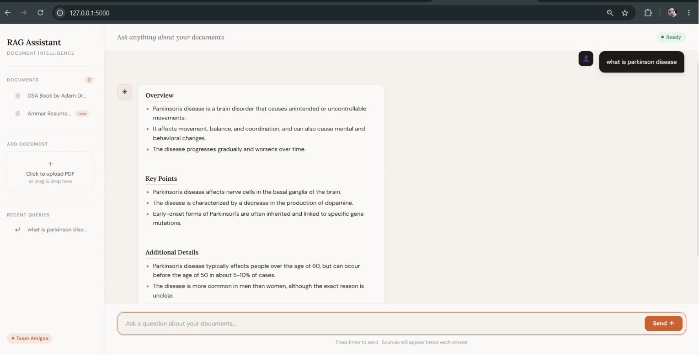
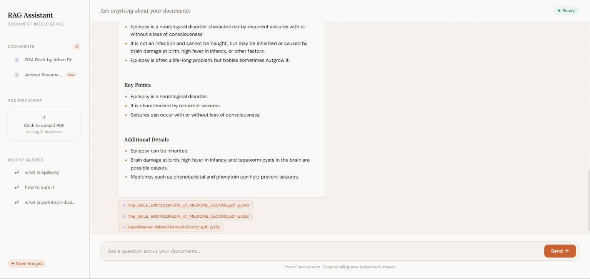

# RAG AI Medical Assistant

A medical document question-answering assistant built with Retrieval-Augmented Generation (RAG). Users can upload PDF medical documents, ask questions in a chat interface, and receive concise answers grounded in the uploaded content with source references.

This project is intended for educational and informational use. It should not be used as a substitute for professional medical advice, diagnosis, or treatment.

## Project Overview

RAG AI Medical Assistant, also called MedBot in the app prompt, helps users search through medical PDFs using natural language. The application extracts text from uploaded PDF files, splits the text into chunks, converts those chunks into embeddings, stores them in a FAISS vector index, and uses a Groq-hosted Llama model through LangChain to generate answers from the most relevant document sections.

The main web app is built with Flask and a custom HTML/CSS/JavaScript chat UI. The repository also includes a Streamlit-based interface in `medibot.py`.

## Features

- Upload PDF documents from the browser.
- Automatically process, chunk, embed, and index uploaded PDFs.
- Ask medical questions through a chat-style interface.
- Retrieve answers from indexed document content using RAG.
- Display source references for generated answers.
- Maintain a sidebar list of loaded documents.
- Prevent duplicate document uploads.
- Handle simple greetings and small talk separately from document search.
- Persist the FAISS vector store locally.
- Provide a sample `.env.example` file without exposing API keys.

## Tech Stack

- Python 3.11+
- Flask
- LangChain
- Groq API with `llama-3.1-8b-instant`
- HuggingFace sentence-transformer embeddings
- FAISS vector database
- PyPDF for PDF loading through LangChain
- HTML, CSS, and JavaScript frontend
- Streamlit alternate interface
- python-dotenv for environment variables

## Installation Steps

1. Clone the repository:

```bash
git clone https://github.com/YOUR_USERNAME/YOUR_REPO_NAME.git
cd YOUR_REPO_NAME
```

2. Create and activate a virtual environment:

```bash
python -m venv .venv
```

On Windows:

```bash
.venv\Scripts\activate
```

On macOS/Linux:

```bash
source .venv/bin/activate
```

3. Install dependencies:

```bash
pip install -r requirements.txt
```

4. Create your environment file:

```bash
copy .env.example .env
```

On macOS/Linux:

```bash
cp .env.example .env
```

5. Add your Groq API key to `.env`:

```env
GROQ_API_KEY=your_groq_api_key_here
```

6. Make sure the runtime folders exist:

```bash
mkdir uploaded_docs vectorstore
```

## Usage Instructions

Run the Flask app:

```bash
python app.py
```

Open the app in your browser:

```text
http://127.0.0.1:5000
```

Then:

1. Upload one or more PDF documents from the sidebar.
2. Wait for the document to be processed and indexed.
3. Ask a question about the uploaded documents.
4. Review the answer and the displayed source references.

To run the alternate Streamlit interface:

```bash
streamlit run medibot.py
```

## Screenshots

Add screenshots to a `screenshots/` folder and update these paths if needed.

### Main Chat Interface


### ASK QUERY



### Answer With Sources



## Project Structure

```text
.
|-- app.py                     # Flask web app and API routes
|-- medibot.py                 # Streamlit alternate interface
|-- citation_utils.py          # Source/reference formatting helpers
|-- connect_memory_with_llm.py # RAG connection logic
|-- create_memory_for_llm.py   # Vector store creation helper
|-- templates/
|   `-- index.html             # Browser chat UI
|-- data/                      # Optional local source documents, ignored by Git
|-- uploaded_docs/             # Runtime uploads, ignored by Git
|-- vectorstore/               # Runtime FAISS index, ignored by Git
|-- .env.example               # Environment variable template
`-- requirements.txt
```

## Future Improvements

- Add user authentication and per-user document collections.
- Support more file types such as DOCX, TXT, and CSV.
- Add document deletion and re-indexing from the UI.
- Improve citation display with snippets and page previews.
- Add streaming responses for a smoother chat experience.
- Add automated tests for upload, retrieval, and answer endpoints.
- Add Docker support for easier deployment.
- Deploy the app to a cloud platform with secure environment variables.

## Security Notes

Do not commit `.env` or real API keys to GitHub. This repository includes `.env.example` only as a template. The actual `.env`, uploaded documents, and local vector database are ignored by Git.
